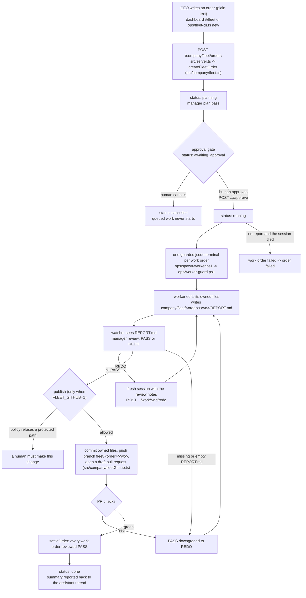
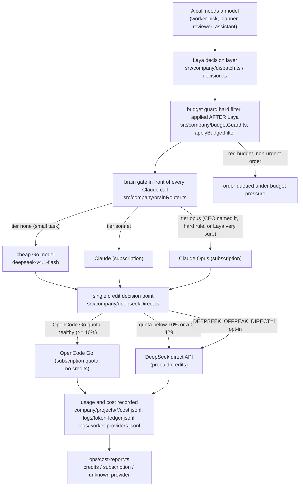

# Architecture

Two views of the system: how an order flows through the fleet, and how a model call is routed
and budgeted. Both diagrams name only code that exists in this repository.

## The order pipeline

Notes on the pipeline, all from `src/company/fleet.ts`, `src/company/fleetGithub.ts` and
`docs/FLEET_OPERATOR_GUIDE.md`:

- Order statuses are `planning`, `awaiting_approval`, `running`, `reviewing`, `done`, `failed`,
  `cancelled`. Work-order states are `planned`, `queued`, `starting`, `working`, `idle`,
  `reported`, `reviewed`, `failed`.
- A watcher tick (default every 5 s, `FLEET_WATCH_INTERVAL_MS`) advances the states.
- A PASS is downgraded to REDO when the work order's `REPORT.md` is missing or empty.
- Cancelling stops new spawns. Running terminals are not killed by the cancel call.
- The publish step is off unless `FLEET_GITHUB=1`. `FLEET_GITHUB_DRY_RUN=1` turns it into a log
  line with no git change.

## Routing and budget logic

Notes on routing and budget, all from `src/company/brainRouter.ts`,
`src/company/budgetGuard.ts`, `src/company/deepseekDirect.ts` and `src/company/offpeak.ts`:

- The brain gate is the only way to reach Claude. Tiers are `none`, `sonnet` and `opus`, and
  every decision is appended to `company/budget/brain-decisions.jsonl`.
- The budget guard is the final filter and is applied after Laya. Under red pressure a
  non-urgent order is queued instead of spawned.
- Credits are spent only when OpenCode Go is exhausted. Healthy quota stays on Go at any hour,
  including DeepSeek's off-peak window. Off-peak direct use requires the
  `DEEPSEEK_OFFPEAK_DIRECT=1` opt-in.
- The DeepSeek clock (`src/company/offpeak.ts`) treats peak as 01:00-04:00 and 06:00-10:00 UTC
  Monday to Friday, with all other hours, plus all of Saturday and Sunday, off-peak.

## Main modules under `src/company/`

| Module | What it does (verified from the file) |
|---|---|
| `fleet.ts` | The fleet orchestrator: order and work-order state machine, planner pass, guarded worker spawn, review and publish. |
| `gates.ts` | Human approval gates. Tasks have a status and the pipeline waits at gates: `pending_intake`, `pending_code`, `pending_merge`. |
| `pipeline.ts` | Task lifecycle engine with three human gates. The manager plans, decides dispatch and reviews; Laya is only the fallback dispatcher. Resumable per stage. |
| `flow.ts` | The dashboard's Flow view: the hand-off chain per recent task, read-only from `task.trace`, cached by file signature. |
| `workers.ts` | Runs one agent (an `opencode` child process or a router LLM call) and records its session, cost and budget. |
| `sessions.ts` | Session registry, one record per agent run. Append-only JSONL with replay and compaction, plus a capped tail file per session. |
| `budget.ts` | Per-agent budgets, keyed by the composite id `<projectId>::<agentId>`, persisted in `company/budgets.json`. |
| `budgetGuard.ts` | Real provider budget pressure: one row per provider, a rules table, the hard filter applied after Laya, and a guarded background poller writing `company/budget/state.json`. |
| `brainRouter.ts` | The Laya gate in front of every Claude call. Tiers `none`/`sonnet`/`opus`; decisions go to `company/budget/brain-decisions.jsonl`. |
| `dispatch.ts` | The Laya dispatcher: which agent handles a task and whether it splits into subtasks. Wording lives in the pure `*QuestionSpec` functions. |
| `deepseekDirect.ts` | The single decision point for DeepSeek's own API as a second bank. Credits are used only when OpenCode Go is exhausted. |
| `offpeak.ts` | The DeepSeek clock. Two peak blocks a day, weekdays only, and the off-peak price rule. |
| `usage.ts` | Subscription quota measurement. The real constraint on the company, as opposed to the virtual per-agent USD allocation. |
| `org.ts` | Company structure persisted as JSON under `company/`. No database: every entity is a file and thread history is per-project JSONL. |
| `roles.ts` | Seven role definitions: what each agent does, which model it uses, its persona, and whether it runs through `opencode` or as a router LLM call. |
| `lifecycle.ts` | Company shutdown and restart: pause new work, checkpoint terminals, snapshot the company into `company/snapshots/<timestamp>/`, hand the killing to `ops/shutdown-all.ps1`. |
| `policy.ts` | The policy file: protected paths a work order may never change and `maxFilesPerWorkOrder`, with glob matching and built-in defaults. |
| `notify.ts` | Webhook notifications for `awaiting_approval`, `done` and `failed`. Off unless `NOTIFY_WEBHOOK_URL` is set. Never throws. |
| `fleetGithub.ts` | The only place that turns a PASS into a draft pull request, and that downgrades a PASS when PR checks are red. Off unless `FLEET_GITHUB=1`. |
| `github.ts` | The git and GitHub helper used by the publish step: `branchFor`, `changedPaths`, `commitOwned`, `push`, `openDraftPr`, `readChecks`, `redactForLog`. |
| `authguard.ts` | Trust-boundary helpers. Defines `TOKEN_HEADER` (`x-company-token`), the loopback check, and the constant-time token comparison. Dependency-free so `ops/` harnesses can use it. |
| `envReload.ts` | Re-reads a small allow-list of settings from `.env` without restarting the router. Copies key names only; no value is returned or logged. |
| `knowledge.ts` | Project context and the graphify knowledge graph integration. |
| `inbox.ts` | The CEO inbox. Every "Needs you" item is actionable in place (approve, cancel, redo, resume). |
| `loopWatchdog.ts` | Names the call that blocked the event loop, caps log spam, and leaves evidence while the loop is still blocked. |

The dashboard itself is static: `src/server.ts` serves `public/` and the v2 views live in
`public/v2/views/` (one file per view, including `fleet.js`).
