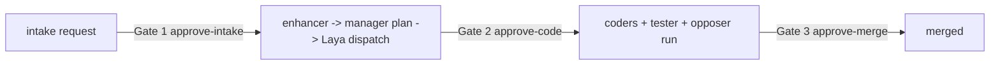

# CEO RUNBOOK — Local AI Company (control panel + launch/stop)

Owner: CEO (you). Project root: `C:\Users\user\Desktop\Default Project`.
Everything below runs **locally on this PC**. No cloud, no external LLM hosting.
Claude is used through the existing subscription OAuth only.

---

## 0. Trust boundary (who can reach the control plane)

**Reality check first.** Until 2026-09-29 the router bound `0.0.0.0:8787` with
**no inbound authentication at all** (`app.listen(config.port)`, no host
argument, and no auth middleware anywhere in `src/`). Any machine on the same
network could therefore:

| Endpoint | What a stranger could do |
|---|---|
| `POST /company/agents/:id/message` (`run:true`) | spend provider budget and run an agent |
| `POST /company/projects/:id/run` (`auto:true`) | execute the whole pipeline |
| `POST /company/assistant/message` (`autoRun`) | decompose an instruction and dispatch agents |
| `POST /company/agents/:id/budget` | re-allocate agent budgets |
| `POST /company/projects` | create a project with a **caller-supplied `rootDir`**, which becomes the agents' `workdir`, where `opencode run --auto --dir <workdir>` writes files |
| `GET /company/stream` | stream the entire company state continuously |

The control plane now has **two independent locks**:

| Lock | Default | How to change | What it stops |
|---|---|---|---|
| **Bind** | `HOST=127.0.0.1` (loopback only) | `HOST=0.0.0.0` in `.env`, deliberately | Off-host peers cannot open a TCP connection at all |
| **Shared secret** | `COMPANY_AUTH_TOKEN=<64 hex>` in `.env` | any long random string, then restart | Every mutating `/company/*` request and `GET /company/stream` (`X-Company-Token` header; `?token=` accepted for EventSource only) |

Rules as implemented (`src/server.ts` guard + `src/company/authguard.ts`):

- A **loopback** peer may `GET` `/company/*` **without** the secret, so the
dashboard, `ops/smoke-company.ts` and the watcher keep working unchanged.
- **Every mutation** (`POST`/`PUT`/`PATCH`/`DELETE`) under `/company/*` requires
the secret, loopback or not.
- `GET /company/stream` requires the secret **always** — it is a continuous dump
of company state. Browsers cannot set headers on `EventSource`, so
`?token=<secret>` is accepted on that one route.
- A **non-loopback** peer is refused for *everything* under `/company/*` (reads
included) unless the secret is presented. The legacy money-spending routes
(`/chat`, `/handoff/*`, `/team/run`, `/notify/slack`, `/route`) are refused
off-host without the secret too.
- `assertConfig()` **refuses to start** when `HOST` is not loopback and no
`COMPANY_AUTH_TOKEN` is set, so an exposed control plane can never be silent.
- The secret is handed to the local dashboard by
`GET /company/auth/bootstrap`, which answers **loopback peers only**, and only
when the `Host` header is a loopback name (blocks DNS-rebinding pages).
`GET /health` reports the posture: `bind` and `authTokenConfigured`.
- There is still **no TLS and no per-user identity**. This is a single-operator
local control plane: treat the secret like a password, keep the bind on
loopback, and never port-forward it.

Check the posture:

```powershell
Invoke-RestMethod http://localhost:8787/health | Select-Object bind, authTokenConfigured
netstat -ano | findstr :8787          # expect 127.0.0.1:8787 only
```

Call a protected endpoint (the token lives in `.env`):

```powershell
$tok = (Select-String -Path .env -Pattern '^COMPANY_AUTH_TOKEN=(.+)$').Matches.Groups[1].Value
Invoke-RestMethod -Method Post -Uri http://localhost:8787/company/agents/coder-1/message `
  -Headers @{ 'X-Company-Token' = $tok } -ContentType 'application/json' `
  -Body '{"text":"status?","run":false}'
```

The same call **without** the header returns `401`
`{"error":"unauthorized", ...}`; from another machine it does not connect at
all (or 401s if you deliberately set `HOST=0.0.0.0`). Rotate the secret by
editing `COMPANY_AUTH_TOKEN` in `.env` and restarting the router. The dashboard
needs no configuration: it is served from the same loopback origin and fetches
the secret from `/company/auth/bootstrap` once per page load.

Re-run the evidence yourself at any time (both scripts exit non-zero on failure):

```powershell
powershell -NoProfile -ExecutionPolicy Bypass -File ops\verify-trust-boundary.ps1
# off-host assertions need a deliberately exposed test instance:
powershell -NoProfile -ExecutionPolicy Bypass -File ops\verify-trust-boundary.ps1 `
  -Base http://127.0.0.1:8799 -LanIp 192.168.29.242 -SkipBindCheck
.\node_modules\.bin\tsx.cmd ops\verify-config-guard.ts    # the fail-closed startup guard
```

`verify-trust-boundary.ps1` checks the bind posture from `/health` and `netstat`,
that loopback reads still work, that every mutation and the SSE stream are
refused without the secret, and (with `-LanIp`) that a non-loopback peer gets
401/conn-refused for `/company/*` *and* the legacy spenders while the same
request carrying the secret passes the guard. Point it at a temporary
`HOST=0.0.0.0` instance on another port to exercise the off-host path without
exposing the real control plane.

---

## 1. One-command launch

The router is **supervised** since 2026-09-29 (CRASHFIX). It is no longer started
directly by whoever happens to be in a terminal: `ops\router-supervisor.ps1` owns it,
and a Windows Scheduled Task (`LayaCompanyRouterSupervisor`) starts that supervisor, so
the router does not live inside any agent's, tool call's or terminal's process tree.

Why: the router died silently at least three times on 2026-09-29. Every observed death
was a **forcible kill** (`Stop-Process -Force`, `taskkill /F`, or an agent's process tree
being torn down) - that runs no JavaScript at all, so there was no stack, no line in
`logs\router.err.log`, and the killed process wrote nothing anywhere. A process cannot
defend itself against that, so the fix is to stop depending on who started it.

```powershell
cd "C:\Users\user\Desktop\Default Project"

# start (idempotent): installs the scheduled task if missing, starts the supervisor,
# waits for /health. Safe to run when the router is already up - it never starts a second one.
ops\run-server-detached.ps1

# where am I? task state, health, listener pid, supervisor pid, log paths
ops\run-server-detached.ps1 -Status

# stop: stop the scheduled task AND the router
ops\run-server-detached.ps1 -Stop

# stop and remove the task so it will NOT come back at logon
ops\run-server-detached.ps1 -Uninstall

# ad-hoc instance on another port: own task name, own lock, own logs, and it can
# never be a second listener on :8787 (the supervisor refuses to bind-race :8787)
ops\run-server-detached.ps1 -Port 8791 -NoTask
```

**Careful with a throwaway instance.** `run-server-detached.ps1 -Port 8791` only changes
*where the router listens*. Its child inherits the real environment, so it would still use
the live `company\` folder and start a second Slack bridge - the exact incident that reaped
a live task earlier today. `-ChildEnv` exists on the **supervisor**, not on the launcher, and
a PowerShell hashtable cannot be passed through `-File`, so a safe throwaway is started like
this from a PowerShell session:

```powershell
# 1. temp copy of the company state (never the live folder)
$dst = "$env:TEMP\company-copy"
Remove-Item $dst -Recurse -Force -ErrorAction SilentlyContinue
New-Item -ItemType Directory $dst | Out-Null
Copy-Item company\*.json, company\*.jsonl $dst -Force

# 2. supervisor on :8791 with SLACK_BRIDGE off and COMPANY_ROOT pointed at the copy,
#    its own lock/log prefix so it cannot collide with the live supervisor
& "$PWD\ops\router-supervisor.ps1" -Port 8791 -LogPrefix router-test `
    -ChildEnv @{ SLACK_BRIDGE = '0'; COMPANY_ROOT = $dst }

# 3. when done (stops that supervisor, that router, releases its lock)
& "$PWD\ops\router-supervisor.ps1" -Port 8791 -LogPrefix router-test -Stop
```

What the supervisor does (`ops\router-supervisor.ps1`, log `logs\router.supervisor.log`):

| Situation | Action |
|---|---|
| `:8787` serves a healthy `/health` | watches, starts nothing (never a second listener, never a second Slack bridge) |
| no listener on `:8787` | starts the router, waits for it to exit, logs the exit code |
| router process exits | logged to `logs\router.crash.log`, restarted after **3 s** (backoff to **30 s** after fast crashes) |
| listener present but `/health` silent for **5 min** | treats it as hung, kills it, restarts (a process that never answers is not "slow") |
| another supervisor already running | exits (single-instance lock `logs\router-supervisor.lock`, PID + process start time) |

Lifecycle forensics live in `logs\router.crash.log`: every `BOOT` (pid, ppid, port),
`UNCAUGHT_EXCEPTION`, `UNHANDLED_REJECTION`, `EXIT` (code + signal) from the router, and
every supervisor start/exit/UP line. All other output is timestamped (`[ISO]`), so a log
that stops mid-stream tells you *when* it stopped.

### The other launcher (still supported)

```powershell
ops\start-company.bat            # Laya + router + mission-control window, then the browser
ops\stop-company.ps1             # router + dashboard only (selector below)
ops\stop-company.ps1 -IncludeLaya
ops\stop-company.ps1 -DryRun
```

`start-company.ps1` opens terminal windows for Laya and the watcher and, for the router,
calls the same supervised path. It is idempotent: it reuses anything that already
answers `/health` and never restarts a running router.

**To stop the company cleanly**, use `ops\run-server-detached.ps1 -Stop` (task + router +
supervisor). `ops\stop-company.ps1` still stops the router process itself, and since the
supervisor would restart it 3 s later, `-Stop` is the one to use when you mean "stay down".


---

## 2. Endpoint reference (from the frozen contract)

Base URL: `http://localhost:8787`. All endpoints return JSON; errors are
`{ "error": "..." }` with a 4xx/5xx status.

**Auth:** every mutating endpoint below (and `GET /company/stream`) also needs
`X-Company-Token: <COMPANY_AUTH_TOKEN from .env>`; loopback reads do not. See
§0 for the full rule set and the 401 shape.

| # | Method + path | What it does |
|---|---|---|
| 1 | `GET /company/panel` | The single dashboard payload: company/CEO header, `visual` counts, `departments`, `projects`, `sessions`, `budgets`, `agents`, `assistant`, `gates`. |
| 2 | `GET /company/sessions` | `{ running, queued, total, items: SessionRec[] }` (newest first). |
| 2b | `GET /company/sessions/:id` | One session record. |
| 3 | `GET /company/budgets` | Totals plus `byAgent` (AgentBudget[]) and `byDepartment` rollup. |
| 4 | `POST /company/agents/:agentId/budget` | Body `{ "allocatedUsd": number }` → updated `AgentBudget`, persisted to `company/budgets.json`. |
| 5 | `GET /company/agents` | Every agent across all projects plus the CEO assistant, with status/budget/last message. |
| 5b | `GET /company/agents/:agentId` | One agent. |
| 5c | `GET /company/agents/:agentId/budget` | That agent's `AgentBudget`. |
| 6 | `GET /company/agents/:agentId/thread?limit=100` | `{ agentId, messages: [{ts, from:"ceo"|"agent", text}] }`. |
| 7 | `POST /company/agents/:agentId/message` | Body `{ "text": string, "run"?: boolean, "force"?: boolean }` → `{ status: "replied"|"queued", reply?, sessionId?, budget? }`. Idle agent + `run !== false` runs the message **now** as that persona. Running agent → message is queued. `402 budget_exhausted` when the agent has no budget left (unless `"force": true`). |
| 8 | `POST /company/assistant/message` | Your CEO instruction. Body `{ "text": string, "autoRun"?: boolean }` → `{ reply, plan[], dispatched[], sessions[], budgets, decisions[] }`. The assistant decomposes the instruction, picks (or creates) a project, creates the task(s) and — with `autoRun !== false` — starts the pipeline **without blocking the HTTP response**. |
| 9 | `GET /company/assistant/thread?limit=100` | `{ status, messages: [{ts, role:"ceo"|"assistant", text, tasks?}] }`. |
| 10 | `GET /company/stream` | Server-Sent Events, `event: panel` every 2000 ms plus an immediate first frame. Safe to leave open. **Requires the secret** (`X-Company-Token`, or `?token=<secret>` for `EventSource`). |
| 11 | `GET /company/org` | The raw org: departments → projects → teams → agents. |
| 12 | `POST /company/projects` | Create a department + project with a default 7-role team. Body `{ departmentName?, projectName?, description?, rootDir?, coderCount?, companyName? }`. |
| 13 | `GET /company/projects/:id` | One project (teams, agents, status). |
| 14 | `POST /company/projects/:id/tasks` | Body `{ "request": "..." }` → new task in `pending_intake` (**Gate 1**). |
| 15 | `POST /company/projects/:id/tasks/:tid/approve-intake` | Approve **Gate 1**. |
| 16 | `POST /company/projects/:id/tasks/:tid/approve-code` | Approve **Gate 2**. |
| 17 | `POST /company/projects/:id/tasks/:tid/approve-merge` | Approve **Gate 3**. |
| 18 | `GET /company/projects/:id/thread` | Team conversation (last 200 messages). |
| 19 | `GET /company/projects/:id/cost` | Cost events + total for that project. |
| 20 | `GET /company/projects/:id/tasks` | All tasks + gate flags. |
| 21 | `POST /company/projects/:id/pause` · `/resume` | Pause/resume a project. |
| 22 | `POST /company/projects/:id/run` | Run the pipeline: body `{ request }` or `{ taskId }`; `auto: true` skips the gates. |
| 23 | `GET /health` | Router health. |
| 24 | Legacy: `/route`, `/chat`, `/handoff/to-claude`, `/handoff/to-opencode`, `/team/run`, `/notify/slack` | Router + handoff + Slack mirror, unchanged. Usable from this machine without a token; **off-host callers need the secret** (these spend provider budget). |
| 25 | `GET /company/auth/bootstrap` | Hands the shared secret to the local dashboard. Loopback peers with a loopback `Host` header only; everyone else gets 403. |

Quick sanity check without a browser:

```powershell
Invoke-RestMethod http://localhost:8787/health
Invoke-RestMethod http://localhost:8787/company/panel | Select-Object company, visual
```

---

## 3. How to add a department / project

```powershell
# New department + project + default 7-role team (manager, enhancer, summarizer,
# opposer, tester, coder-1, coder-2) in one call:
$body = @{
  departmentName = "Legal"
  projectName    = "Contract Review"
  description    = "Review inbound contracts and flag risky clauses"
  coderCount     = 2
} | ConvertTo-Json
Invoke-RestMethod -Method Post -Uri http://localhost:8787/company/projects `
  -ContentType 'application/json' -Body $body
```

The dashboard's "new project" form does exactly this.

**Caveat:** `POST /company/projects` always creates a **new department** with the
name you pass (it does not attach to an existing department of the same name).
To add a *second project inside an existing department*, or to hand-edit teams and
models, edit `company/org.json` directly:

1. append the project object to `projects` and set its `departmentId`;
2. add that project id to `departments[].projectIds`.

No restart is needed: `loadOrg()` re-reads `org.json` from disk on every request, so
an edit made in an editor is picked up by the running router immediately (refresh the
dashboard). Only re-open the file after a `POST /company/projects` has rewritten it,
or you will clobber that change.

Per-project landing directory defaults to `company\projects\<projectId>\repo`; each
agent gets its own `repo\agents\<agentId>` workdir.

---

## 4. How to set an agent budget

Budgets are per **agent** (a job-scoped allocation), persisted in `company\budgets.json`.

```powershell
# see current allocations
Invoke-RestMethod http://localhost:8787/company/budgets | Select-Object totalUsd, spentUsd, remainingUsd

# grant / raise a budget (USD). This is the value used for the agent's *job*.
Invoke-RestMethod -Method Post -Uri http://localhost:8787/company/agents/coder-1/budget `
  -ContentType 'application/json' -Body '{"allocatedUsd": 5}'

# single agent view
Invoke-RestMethod http://localhost:8787/company/agents/coder-1/budget
```

Rules of thumb:

- `remainingUsd = allocatedUsd - spentUsd` (never below 0), `pctUsed` 0..100,
  `status` flips to `budget_exhausted` at zero.
- The assistant **drops any hire that cannot afford the work** and says so in
  `decisions` — top up first if you want work dispatched.
- Sending a message to an exhausted agent returns `402 budget_exhausted`;
  `{"text": "...", "force": true}` runs it anyway (spend still recorded).
- Tiering: `cheap` (DeepSeek/Qwen/GLM) → `mid` → `frontier` (Claude Sonnet/Opus).
  Keep Opus rare on the Pro subscription; the router already falls back on 429.

---

## 5. How to talk to one agent

```powershell
# read its thread
Invoke-RestMethod "http://localhost:8787/company/agents/opposer/thread?limit=50"

# send it a message and get the reply now
Invoke-RestMethod -Method Post -Uri http://localhost:8787/company/agents/opposer/message `
  -ContentType 'application/json' `
  -Body '{"text":"Review the last merged diff for silent failure modes."}'

# queue without executing
... '{"text":"Later: tighten the test plan.","run":false}'
```

If the agent is already running, the reply comes back as `status: "queued"` and is
drained when its current session finishes. In the dashboard use **Agent console**:
pick an agent → read thread → send message → watch the reply and budget bar.

**Talking to the company as a whole** (assistant console / `/company/assistant/message`):

```powershell
$body = @{ text = "Get the QA department to add a regression test for the login flow"; autoRun = $true } | ConvertTo-Json
Invoke-RestMethod -Method Post -Uri http://localhost:8787/company/assistant/message `
  -ContentType 'application/json' -Body $body
```

The response is immediate: `plan` (what it intends), `dispatched` (task ids created),
`sessions` (started), `decisions` (who was skipped and why). Progress appears in the
sessions board, the project thread and the mission-control window.

---

## 6. The 3 gates (human approval points)



| Gate | Meaning | Task status while waiting | Approve with |
|---|---|---|---|
| **1. intake** | You accept the raw request and allow the enhancer/manager to spend planning budget. Nothing is decomposed before this. | `pending_intake` | `POST /company/projects/:id/tasks/:tid/approve-intake` |
| **2. code** | You approve the plan **before** real coding starts (the expensive part: coders, tester, opposer). | `pending_code` | `.../approve-code` |
| **3. merge** | You approve the produced work before it is merged into the project root. | `pending_merge` | `.../approve-merge` |

```powershell
# what is waiting on you (also the "Gates" card in the dashboard)
Invoke-RestMethod http://localhost:8787/company/panel | Select-Object -ExpandProperty gates

Invoke-RestMethod -Method Post -Uri "http://localhost:8787/company/projects/<projectId>/tasks/<taskId>/approve-intake"
```

Verified lifecycle: `pending_intake →(approve-intake)→ … → pending_code →(approve-code)→ … → pending_merge →(approve-merge)→ merged`.
The pipeline polls for gate approval asynchronously, so the router never blocks while
waiting for you. `POST /company/projects/:id/run` with `"auto": true` skips all three
gates — use it deliberately.

---

## 7. Where the files live

| Path | Contents |
|---|---|
| `company\org.json` | Company → departments → projects → teams → agents (models, workdirs, status). |
| `company\budgets.json` | Per-agent allocation/spend (`allocatedUsd`, `spentUsd`, `sessionsRun`). |
| `company\sessions.jsonl` | One JSON line per session snapshot (append-only, last line per `id` wins) — the sessions board and mission control read this. |
| `company\assistant.jsonl` | Your CEO messages and the assistant's replies/plans. |
| `company\projects\<projectId>\thread.jsonl` | The project's team conversation (who said what, when). |
| `company\projects\<projectId>\cost.jsonl` | Cost events for that project (model, tokens, USD). |
| `company\projects\<projectId>\tasks.json` | Tasks, statuses and the three gate flags. |
| `company\projects\<projectId>\repo\` … `\agents\<agentId>\` | The working tree and each agent's own workdir. |
| `ops\watch-company.ps1` | Mission control (read-only terminal dashboard: sessions, budgets, latest chatter). |
| `logs\router.out.log` | Router stdout, every line timestamped `[ISO]`. |
| `logs\router.err.log` | Router stderr (a real crash stack or a tsx/esbuild build error lands here). |
| `logs\router.crash.log` | **Lifecycle forensics:** every router `BOOT` (pid, ppid, port), `UNCAUGHT_EXCEPTION`, `UNHANDLED_REJECTION`, `EXIT` (code + signal) and every supervisor start/exit/UP/child-exit line with timestamps. **Per port:** anything not on 8787 writes `logs\router-<port>.crash.log`, so throwaway instances cannot bury the live trail. |
| `logs\router.supervisor.log` | What the supervisor decided (started, watched, restarted, backoff). |
| `logs\router-supervisor.lock` | The single-supervisor lock (pid + process start time). |
| Terminal windows | Laya still logs in its own window; the router does **not** - it is headless since the supervisor took over, and everything it prints goes to `logs\router.out.log`. |

Handy inspection:

```powershell
Get-Content company\sessions.jsonl -Tail 5
Get-Content company\projects\<projectId>\thread.jsonl -Tail 10
Get-Content company\budgets.json -Raw
```

---

## 8. Troubleshooting

| Symptom | Likely cause | Do this |
|---|---|---|
| The router "died" with **no** stack, an empty `ERR` and a log that just stops mid-stream | It was **killed**, not crashed: `Stop-Process -Force` / `taskkill /F` / a tool call's process tree being torn down is `TerminateProcess`, which runs no JavaScript, so nothing can be logged by the dying process. Real examples from 2026-09-29: `taskkill /F /IM node.exe /FI "PID ne %JCODE_PID%"`, `Get-NetTCPConnection -LocalPort 8787 ... Stop-Process -Force`, `ops/run-server-detached.ps1 -Stop`, and the CRASHFIX kill-recovery drill. | Nothing to do: the supervisor restarts it within 3 s and records the exit code in `logs\router.crash.log` (`SUPERVISOR child-exit ... exitCode=-1` is the signature of a kill). To find the killer, grep the agent transcripts for a kill command in the minute before that timestamp. |
| `Get-Item logs\router.out.log` shows the log stopping at `hh:mm:ss` and the dashboard went blank | Same as above (the killed router writes its last line *before* dying, and the supervisor's log shows what happened next). | `ops\run-server-detached.ps1 -Status`, then read `logs\router.crash.log`. |
| `/health` answers but takes 5-20 s, dashboard times out, `netstat` shows a listener that "does nothing" | **Event-loop saturation, not a crash.** `GET /company/panel` is ~1.5 MB and took **8.1 s** under load; `public/index.html` polls it every 2 s (`setInterval(..., 2000)`), and `GET /company/stream` re-serialises the whole panel every 2 s per client. `company\sessions.jsonl` is ~3.5 MB, so each panel build is a synchronous multi-megabyte read. | Close extra dashboard/SSE tabs and stop agents' polling loops. The durable fix is to slim `panelData()` (tail-read `sessions.jsonl`, cap history) and poll every 5-10 s - `src/company/panel.ts` + `public/index.html` (not the supervisor's problem, but it *looks* exactly like a dead router). |
| Router listens but never answers `/health` at all for minutes | Its event loop is blocked by someone's synchronous work in-process. | The supervisor treats 5 consecutive minutes of silence as hung and replaces it (`SUPERVISOR unresponsive ... -> killing it` in `logs\router.crash.log`). `-UnresponsiveMinutes 0` disables that. |
| The dashboard "looks dead" but `/health` *sometimes* returns 200 (measured 2026-09-29: ~40 % of probes took 8-12 s or timed out while other orders ran `tsc`, a `vite` dev server, a `serve` static server and a backend load replay, with 1.4-2.0 GB free RAM) | **Event-loop starvation that comes and goes.** Two causes were removed on 2026-09-29 (`panelData()` memoised: 1.52 MB -> 222 KB; the in-router reaper's synchronous PowerShell replaced with async `execFile`), but the pipeline / briefing / fleet watchers and plain RAM pressure remain. | Expect it while the box is saturated: `/company/panel` and `/health` answer in milliseconds in a quiet window (measured 0.002-0.76 s over 3 rounds) and stall together when the machine thrashes. Do not read a single timeout as "the router is dead" - probe `/health` a few times, and check `logs\router.err.log` for `[fleet] not spawning: ... < MIN_FREE_RAM_MB`. |
| You need a **new router revision live** (a peer changed `src/*` and it must be loaded) | The router only loads source at boot, so a restart is the deploy. | Use the supervised mechanism, never `taskkill /IM node.exe`. **Either** let the supervisor do it: if `/health` fails for 5 consecutive minutes the watchdog replaces the listener by itself (observed 2026-09-29 19:40:16 -> healthy at 19:42:32, 5.3 s for attempt 2; attempt 1 had already exited `code 1` on a peer's transient build error and was retried automatically). **Or** kill only the listener's own tree: get the pid from `Get-NetTCPConnection -LocalPort 8787 -State Listen`, confirm it with `Get-CimInstance Win32_Process -Filter "ProcessId=<pid>"` (it must be `node.exe ... src/server.ts`), then `taskkill /PID <pid> /T /F` - the supervisor starts a fresh one within ~3 s. |
| A restart would "help" but the pipeline has a task parked at a gate | On boot the router reconciles in-motion work; a task waiting for the CEO's approval has the router as its runner, so the reconcile marks it **failed**. | Check `company\projects\*\tasks.json` for a task awaiting a gate (and `/company/flow`) before restarting. On 2026-09-29 a clean deploy was deliberately **not** run for this reason; the next legitimate restart exercises it instead. |
| The scheduled task is `Running` but the router is not up | The supervisor only starts the router when port 8787 has no listener; if something else holds the port it waits. | `ops\run-server-detached.ps1 -Status`; look for `port 8787 has a listener (pid ...) but /health is not ok` in `logs\router.supervisor.log`. |
| Two routers on :8787 / duplicate Slack replies | Should be impossible now: the supervisor refuses to start a second listener and the lock allows one supervisor. If it happens, something started `src/server.ts` directly. | `netstat -ano | findstr :8787` and compare with the lock's pid; kill the extra one (not the supervised one - it has the lower start-time match in `logs\router-supervisor.lock`). |
| `ops\stop-company.ps1` says it stopped the router, and it is back 3 s later | Expected: the supervisor restarts it. | Use `ops\run-server-detached.ps1 -Stop` (stops the task *and* the router) or `-Uninstall` to remove the task. |
| Dashboard shows `HTTP 401` on an action, or `curl` returns `{"error":"unauthorized"}` | The request reached a mutating `/company/*` route without `X-Company-Token` (or with a stale one after a rotation). | Check `Invoke-RestMethod http://localhost:8787/health \| Select-Object authTokenConfigured`; copy the current value from `.env` and send it as `X-Company-Token` (or reload the dashboard, which fetches it itself). Rotation takes effect on restart. |
| Router exits immediately with `Refusing to start: HOST=... exposes the company control plane off-host with no COMPANY_AUTH_TOKEN` | `HOST` was set to a non-loopback address (e.g. `0.0.0.0`) without a secret. | Deliberate fix: set `COMPANY_AUTH_TOKEN` in `.env`. Safer fix: remove `HOST` (binds `127.0.0.1`). |
| Zero-byte files with odd names appear in the project root (`{const`, `console.log('ERR`, `x`, a `%T%` folder) | Someone ran an **unquoted** ad-hoc `node -e` one-liner at a `cmd.exe` prompt in this directory. `cmd` reads the `>` in a JavaScript arrow (`=>`) as a redirect and creates a file named after the following word; `%T%` was a mistyped `%TEMP%` (undefined variables stay literal at a cmd prompt). | Delete them; they are inert. Quote the whole snippet (`node -e "..."`) or write a probe file instead. Not producible by the router: workers spawn `opencode` with an argv array and no shell (`workers.ts`), and `usage.ts` only ever runs static `cmd.exe` args. See §10. |
| Launcher says router not answering; router window shows `EADDRINUSE` | Something else owns port 8787 (a stale router, another project). | Find the owner: `Get-NetTCPConnection -LocalPort 8787 \| Select-Object OwningProcess,State` then `Get-CimInstance Win32_Process -Filter "ProcessId=<pid>"`. If it is this project's `src/server.ts`, stop it with `ops\stop-company.ps1`; if it is another app, change the port or close that app. Never kill blindly. |
| `Laya health NOT RESPONDING` after 60 s | First run downloads/preloads 3 checkpoints (slow), or the venv/laya install is broken. | Watch the Laya window. Missing venv → `deps\setup.ps1`. Manual start: `scripts\serve-laya.ps1`. Check `Invoke-RestMethod http://127.0.0.1:8000/health`. |
| Router answers but routing is degraded / "Laya down" warnings | Laya process died or is still loading. | Restart just Laya in a new window: `powershell -File scripts\serve-laya.ps1`. Dispatch falls back but plans get weaker. |
| A coder session sits "running" forever (opencode hang) | Known blocker: `opencode run` sometimes never closes its process (permission/loop/no `step_finish`). | Check the session in `/company/sessions`; the agent's workdir is `company\projects\<id>\repo\agents\coder-N`. Reproduce manually with the same args (`opencode run --dir <workdir> --model opencode-go/kimi-k2.7-code --auto --format json "<prompt>"`). Then re-run the task (`POST .../run` with `taskId`). Killing the stuck `opencode.exe`/`node.exe` child is safe; it is not the router. Full analysis: `HANDOVER.md` §6. |
| Claude returns 429 mid-run | Pro subscription quota. | Expected: `workers.ts` falls back to DeepSeek via the Go gateway (and the router's `generate` falls back to Muse). No action needed — check the session's `model` field to confirm the fallback. Keep Opus rare; Sonnet is the default. |
| Agent replies `402 budget_exhausted` | Agent has no remaining budget. | `POST /company/agents/:agentId/budget {"allocatedUsd": n}` to top up, or resend with `"force": true`. The assistant will silently skip unfunded hires and list them in `decisions`. |
| Dashboard empty / stale | Router restarted or panel cache is old. | Refresh `http://localhost:8787`; verify `GET /company/panel`; SSE `/company/stream` also pushes an immediate first frame. |
| `stop-company.ps1` stops nothing | Selector did not match (different entrypoint, e.g. `dist/server.js`). | Run `ops\stop-company.ps1 -DryRun` and read the "matched" list. The selector only matches processes whose command line names **this** project root **and** `src\server.ts`. |
| Mission control window is blank/closing | Terminal too small or the watcher was started twice. | Enlarge/pin the window; only one watcher is needed (the launcher reuses an existing one, `-NoWatch` skips it). |

---

## 8b. Restarting the router ON PURPOSE (recipe verified 2026-09-29 by CLOSEOUT)

Use this when the router is listening but `/health` is slow or silent and you do **not** want to wait
for the 5-minute watchdog. It keeps the supervisor in charge, so the router comes back by itself.

```powershell
cd "C:\Users\user\Desktop\Default Project"
ops\run-server-detached.ps1 -Status                     # task state, health, listener pid, supervisor pid
netstat -ano | findstr LISTENING | findstr :8787        # confirm exactly ONE listener pid

# find the tree root: the supervisor's own cmd.exe child that owns the tsx/node pair
#   cmd.exe <root>  ->  node tsx cli.mjs src/server.ts  ->  node (the listener)
# kill ONLY that tree, from its root, and let the supervisor bind the freed port:
taskkill /PID <rootCmdPid> /T /F
```

Then watch it come back (it took 2.2 s on 2026-09-29 after a full day of freezes):

```powershell
Get-Content logs\router.crash.log -Tail 5      # SUPERVISOR starting router attempt=N / SUPERVISOR router UP pid=...
curl.exe -s -o NUL -w "%{http_code} %{time_total} %{size_download}`n" -m 15 http://127.0.0.1:8787/health
```

(That `` `n `` is PowerShell's newline escape. At a **cmd** prompt it is not an escape and curl prints it
literally - verified 2026-09-29 - so there write `\n` instead: `-w "%{http_code} %{time_total} %{size_download}\n"`.)

Three things that bit us, so read them before you improvise:

| Observation | What it means |
|---|---|
| `SUPERVISOR starting router attempt=N` followed by `router exited before answering (health never ok)` and `child-exit ... exitCode=1` while the old pid still owns :8787 | The supervisor tried to start a **second** router and it died with `EADDRINUSE`. That is why the port must be *freed* (the kill above), not just "unhealthy". Expect several of these attempts while a hung listener holds the port; they are harmless (only one process can ever bind) but they make the logs look like a crash loop. |
| `logs\router.err.log`: `[autoclose] process table unavailable (nothing will be closed): timed out after 20000ms (child killed)` | The reaper's `execFile` PowerShell process listing is timing out under load. The reaper **fails closed** (it closes nothing) and the router keeps serving; that is the fixed behaviour, not a new bug. |
| `logs\router.err.log`: `[fleet] not spawning: NNNN MB free < MIN_FREE_RAM_MB=2048` | The box is below the Fleet's own spawn floor. Nothing new will be spawned until free RAM recovers. Check `Get-CimInstance Win32_OperatingSystem | Select-Object FreePhysicalMemory`. On 2026-09-29 free RAM sat at 1.5-2.0 GB of 16 GB with ~20 jcode TUI clients alive. |

Two facts about terminal auto-close that matter operationally (measured by CLOSEOUT):

- `%USERPROFILE%\.jcode\streaming_pids\<sessionId>` and `.jcode\active_pids\<sessionId>` hold the
  **shared jcode server pid** and are rewritten while a client is *attached*. They are not "generating
  right now" flags, so the reaper's `still streaming` / `activity Ns ago < grace` skips fire for every
  live client, however idle it is. AUTOCLOSE therefore only ever closes terminals whose client process
  is already gone (empty console windows) - a session with a live TUI needs a manual close.
- To close one by hand, verify the pid by its own command line first, then kill the window tree and the
  TUI, and archive before you do it:

  ```powershell
  Get-CimInstance Win32_Process -Filter "Name='jcode.exe'" |
    Where-Object { $_.CommandLine -like '*--resume session_<name>_*' } |
    Select-Object ProcessId, ParentProcessId, CommandLine
  # archive: company\reports\terminals\<name>.md (append, never overwrite)
  taskkill /PID <clientPid> /F
  ```

  `jcode --resume <sessionId>` reopens a closed session from its archive, so nothing is lost.

---

## 9. Safety notes (stop script selector)

`ops\stop-company.ps1` is deliberately narrow. It stops only:

- `node.exe` / `cmd.exe` whose normalized command line contains this project root
  **and** `src\server.ts` (the whole `npm run dev` → tsx chain), plus the chain
  `cmd.exe` wrapper that ran `tsx src/server.ts` relative to the root;
- with `-IncludeLaya`, `python.exe` running `-m laya.serve` **from this project's
  `deps\venv`**.

It never touches itself or its own parent chain, other projects' processes, VS Code
helpers, `opencode.exe`, or a Laya server started from a *different* Python install
(the script lists such processes and explicitly leaves them alone). Run
`-DryRun` first if you want to see the exact PID list. Observed matches on this
machine: router chain pids 2140 + 15084 + 20956, Laya pid 20524 (venv), and a
global-Python `laya.serve` that the selector correctly refuses to kill.

---

## 10. Stray artifacts removed 2026-09-29 (and why they were not a run-path bug)

The project root carried four zero-content leftovers, all created between 15:18
and 15:25 on 2026-09-29 by **ad-hoc `cmd.exe` typing in this directory**, not by
the router:

| Artifact | Size | Created | Explanation |
|---|---|---|---|
| `%T%\run\index.js` | 56 B | 15:18:59 | `%T%` is not a Windows variable. At a `cmd` prompt an undefined `%VAR%` stays **literal**, so `mkdir %T%\run` + `echo ... > %T%\run\index.js` created this tree. Its content is an argv probe — `console.log('ARGV', process.argv.slice(2).join(' '))` — a leftover from the opencode argv/quoting investigation (`ops/probe-node.mjs`, `HANDOVER.md` §6). |
| `x` | 0 B | 15:19:15 | A bare `> x` redirect target from the same ad-hoc probing. |
| `{const` | 0 B | 15:19:15 | `cmd` reads the `>` of a JavaScript arrow (`=>`) as an **output redirect** and names the file after the next word. Reproduced byte-for-byte: `node -e const f = (x) => {const y = 1;}` creates a file literally named `{const` in the current directory; `node` then dies on the mangled argument (`-e const`) and writes only to stderr, which is why the file is 0 bytes. |
| `console.log('ERR` | 0 B | 15:25:31 | Same mechanism: `node -e const g = () => console.log('ERR', y)` → redirect target `console.log('ERR`. |

The reproduction was run in `%TEMP%` (never in the project root) and matched all
four names, including the identical truncation of `console.log('ERR`.

**Confirmed live (15:53:57, during the remediation session).** A second file of
this class appeared while this fix was being written: a file named `{`,
1587 bytes, containing a `tsx`/esbuild error dump. Its `lineText` shows the
culprit command verbatim:

```
import('./src/company/knowledge.js').then(m => {const d =
  m.projectContext('pmumhp51u', 3000); ... })
```

`cmd.exe` took the `>` of `m => ...` as a redirect whose target is the next
token, `{` (with `=>{const` the target is instead `{const` — exactly the 15:19
artifact), handed `node` a mangled one-liner, and wrote the resulting error into
the file it had just created. Whoever (or whatever agent) typed that line was
working in the project root, so the artifact landed there. It was deleted along
with the others.

**Why this is not the run path.** `src/company/workers.ts` spawns `opencode`
with an argv array and `stdio: ["ignore", "pipe", "pipe"]` and **no shell**, so a
prompt or a path can never turn into a redirection; `src/company/usage.ts` is the
only place that goes through `cmd.exe`, and only with hard-coded args
(`jcode usage --json`, `opencode auth list`, `claude auth status`). These were
interactive typing accidents. All four were deleted; nothing referenced them.

Rule of thumb: quote the whole snippet (`node -e "const f = () => {...}"`), or
put the probe in a file under `ops/`, instead of typing it at a raw `cmd` prompt.

---

## 11. Needs you buttons

The dashboard shows open decisions in two places: the **Briefing** page
(`#/briefing`) and a compact panel at the top of the **Assistant** home
(`#/assistant`). Each item has a `kind` that controls which buttons appear.

| Kind | Meaning | What you see |
|---|---|---|
| `approve` | A task or gate is waiting for your go-ahead. | Action buttons such as **Approve** / **Drop**. |
| `choice` | The assistant is asking you to pick between alternatives. | The `question` text plus one button per choice. |
| `provide` | The system needs a secret or key from you. | A masked `<input type=password>` labelled with `input.label`, plus the action button. |
| `external` | Something outside the dashboard must happen first (for example, raising a provider spending limit). | The `question` text plus buttons; an `open_link` action opens the provider page in a new tab. |

How it works:

- Clicking a button POSTs to `/company/needs-you/<id>/resolve` with `{actionId, input?}`.
- For `provide` items, the value is read from the password field, sent once, and the field is cleared. The key value is **never** written into the DOM as text, logged to the browser console, or saved to `localStorage`.
- Successful keys are saved to `.env` by the resolver (for example, `OPENCODE_API_KEY`). The UI shows only "Key saved."
- Every click is logged to `company/reports/needs-you-decisions.json` (capped at 500 entries: `{at, who, itemId, actionId, effect, ok, message}`). The decision log never contains secret values.
- You can also answer in the Assistant chat by naming an option (for example, "use Kimi" or "approve the office page"). `assistant.ts` runs `tryResolveFromChat()` on CEO messages and resolves matching open items.
- If a click fails, the item stays in place and a one-line error appears under the list; the router is still up.
